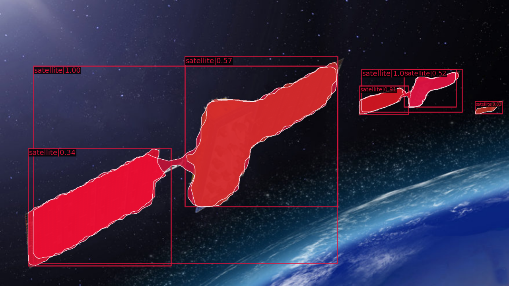

# 2023 人工智能创新应用大赛——深空探测主题赛 组别2 比赛文档

## 数据集概况
赛事组织方提供了`train`,`test`两组数据集，分辨率均为`1280×720`。其中`train`包含2517张标注好mask的图片，`test`包含600张未标注的图片。数据集中的图片均为电脑生成的卫星图像，每张图中包含一个乃至若干个卫星，图像的亮度、色调、对比度、模糊程度在一定范围内各不相同。

本项赛事的题目是对卫星这一类物体进行实例分割(Instance Segmentation)。

## 模型调研
赛事提供的baseline是2018年的Mask R-CNN模型。用于实例分割的Mask R-CNN在Faster R-CNN的基础上添加了一个用于语义分割的分支，提出了用RoIAlign方法替代RoIPooling，从而使保留的精度能够实现像素点的精确分割。这一算法的主要步骤为：
1. 将图片输入Backbone网络(特征提取网络如ResNet),得到feature map;
2. 对feature map的每个像素位置设定固定个数的RoI(Region of Interest)，将RoI输入RPN网络进行二分类(是否包含物体)，得到包含物体的RoI;
3. 对上述包含物体的RoI执行RoIAlign操作，将feature map中的feature与原图的pixel对应起来;
4. 将RoIAlign得到的结果输入Head：通过FC Layers得到每个RoI的类别(class)并通过回归得到边界框(bounding box)，同时将这些RoI输入FCN(Full Convollutional Network)得到物体的mask，完成分割。

Mask R-CNN对于包含多种类物体的复杂图片能够达到优秀的精确度，但是我们认为它并不适用于本次比赛的题目。首先指出Mask R-CNN的确存在问题：
1. 它进行的分割依赖于RPN输出的物体框(RoI)，如果物体框不准则会导致分割的结果偏差更大;
2. 由于物体框只能是矩形，它对形状不规则的物体分割效果不好;
3. 运行速度比较慢

再看我们本次数据集的特点：
1. 只有一类物体`'satellite'`，图像相对比较简单;
2. 人造卫星的形状不规则，轮廓细节较多，而且由于在太空低重力环境下，人造卫星的朝向十分随机，不容易框住;
3. 如果算法将来用于人造卫星的空间态势感知，就必须实现低延迟的目标识别与分割。

结合Mask R-CNN自身的不足以及数据集的特点，我们得出它不适用于本次比赛的结论。使用baseline得到的糟糕结果将展示在下一章中。

通过调研SOTA模型，我们了解到[YOLOv5 release v7.0](https://github.com/ultralytics/yolov5/releases/v7.0)给出了性能极佳的实例分割模型，具有较高精确度的同时还有极快的速度，甚至只用cpu就能达到仅60ms的延迟。[YOLOv5](https://github.com/ultralytics/yolov5)的github仓库获得了41.4k stars，十分受欢迎并且容易部署。下面我们简单介绍它的算法与baseline的不同之处，并证明它更加适合我们本次的实例分割任务。

在目标检测的anchor-based算法中，有着一阶段和二阶段之分: 例如baseline的R-CNN算法就是一个二阶段算法，特征是算法需要经历首先从图像中生成region proposals，再从region proposals生成最终的物体边框这两个阶段。而YOLO是一个一阶段算法，其基本思想为将整张图片划分为若干网格，通过物体中点所在的网格进行训练，从而把目标检测转变为一个回归问题。这样一来就不需要像R-CNN一样再单独训练一个RPN用于给出region proposals，于是作者将其取名为YOLO(You Only Look Once); 此外YOLO具有极快的检测速度，能够轻松地实时运行。

YOLOv1-v5在YOLO算法的基础上，不断引入SOTA算法的各种提升模型表现的feature。YOLOv5的Backbone采用Focus结构和CSP(Cross Stage Partial)结构，Neck部分采用FPN(Feature Pyramid Network)和PANet(Path Aggregation Network)以实现特征的多尺度融合，Head采用了三个不同的输出以进行多尺度预测。YOLOv5 release v7.0在网络的Head部分添加了用于语义分割的网络，从而实现了实例分割。

# 操作

## 数据集处理

我们编写程序从`train`数据集中随机抽出300张作为验证集`val`，这有利于在后续训练中监测训练的情况，调整超参数使模型更准确并预防模型的过拟合。

此外，赛事组织方提供的数据标注为COCO格式，而我们要使用YOLOv5模型需要使用YOLO格式的标注数据。于是我们使用YOLOv5开发者提供的格式转换器仓库[JSON2YOLO](https://github.com/ultralytics/JSON2YOLO)将json格式的标注文件转换为YOLO所需的txt格式。

## baseline训练
我们将baseline配置文件`maskrcnn_r50.py`中的数据集配置修改为我们自己的数据集路径，用TESLA V100 GPU训练12个epoch。

由于`test`数据集没有标注，我们并不能定量对模型的准确性进行评估，因此我们让训练好的模型对`test`数据集中的图像进行预测，并在此展示对几张图片的探测和分割效果。

可以看出，baseline(Mask R-CNN)的探测产生了很多误判，例如有很多把一个卫星的部分当作整个卫星识别的情况；此外baseline分割的边缘十分粗糙，难以还原原始图片中的细节。最典型的问题体现在最后一张图，图中两颗人造卫星都没有被正确识别与分割。我们认为出现这一问题的根本原因是Mask R-CNN算法首先在图像中生成region proposals，对于人造卫星这种部分与整体相差不大的物体，很容易将只包含部分物体的区域作为RoI，继续在这个本就错误的区域内得出的bbox和mask必然会更加错误。各种图像增强、后处理并不能改变其本质，注定是吃力不讨好的事，于是我们选择放弃R-CNN系的模型。

## YOLOv5训练

