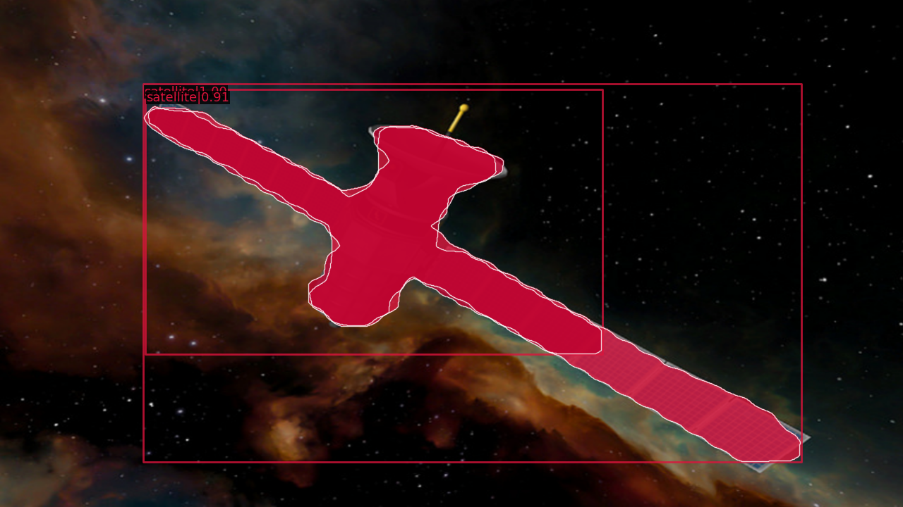
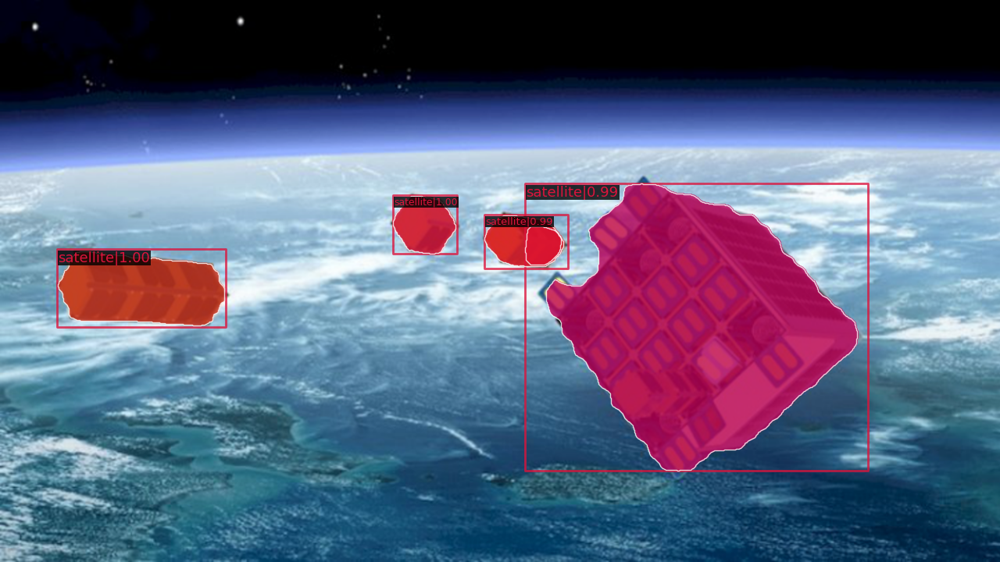
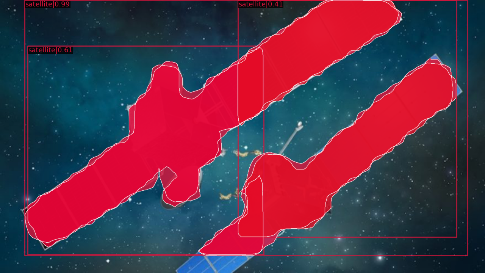
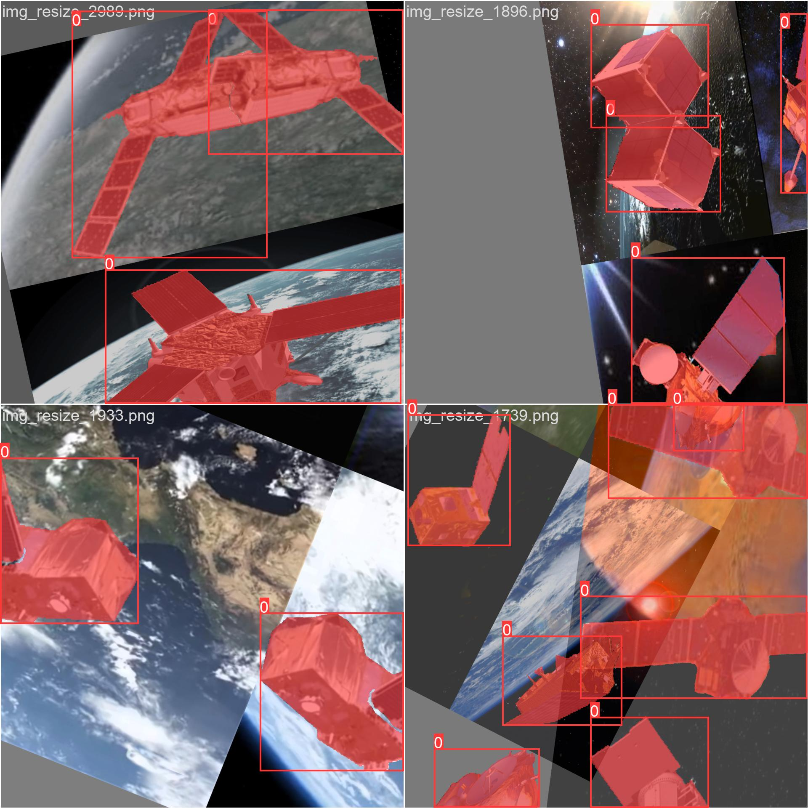
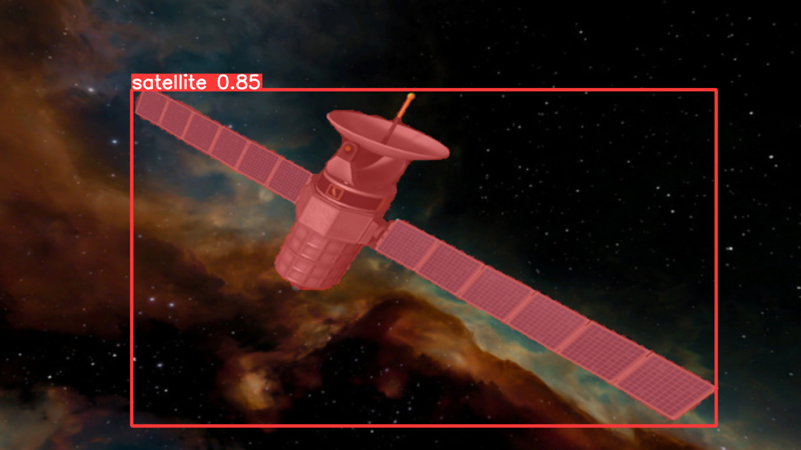
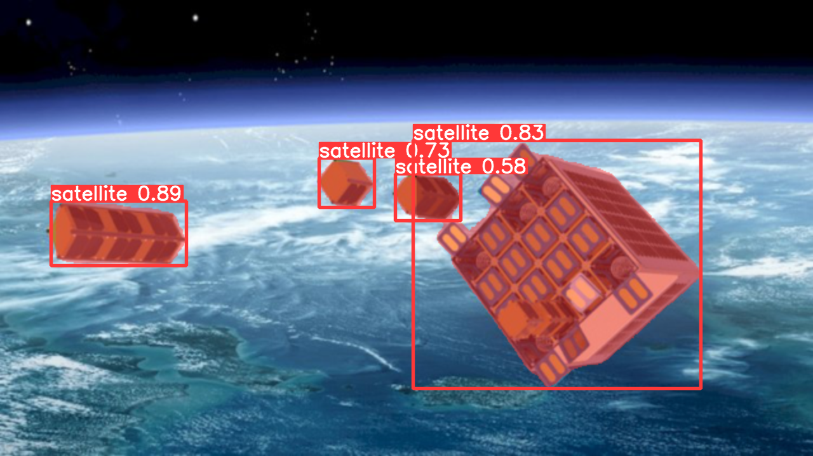
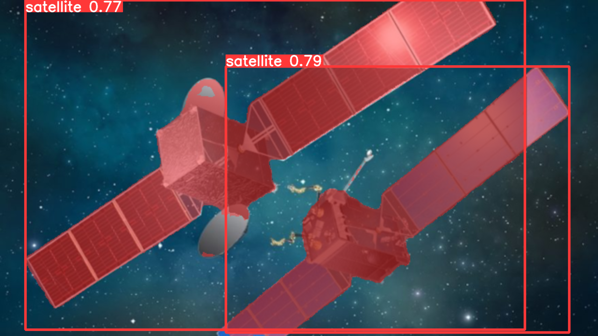
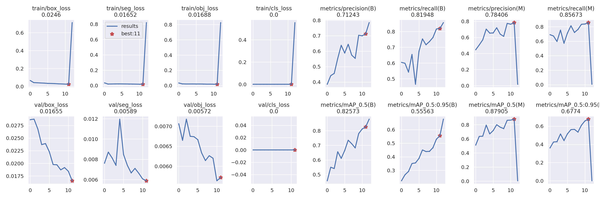

# 2023 人工智能创新应用大赛——深空探测主题赛 组别2 比赛文档

- [2023 人工智能创新应用大赛——深空探测主题赛 组别2 比赛文档](#2023-人工智能创新应用大赛深空探测主题赛-组别2-比赛文档)
  - [数据集概况](#数据集概况)
  - [模型调研](#模型调研)
- [操作](#操作)
  - [数据集处理](#数据集处理)
  - [baseline训练](#baseline训练)
  - [YOLOv5训练](#yolov5训练)
- [训练结果](#训练结果)
- [结论](#结论)
  
## 数据集概况

赛事组织方提供了`train`,`test`两组数据集，分辨率均为`1280×720`。其中`train`包含2517张标注好mask的图片，`test`包含600张未标注的图片。数据集中的图片均为电脑生成的卫星图像，每张图中包含一个乃至若干个卫星，图像的亮度、色调、对比度、模糊程度在一定范围内各不相同。

本项赛事的题目是对卫星这一类物体进行实例分割(Instance Segmentation)。

## 模型调研

赛事提供的baseline是2018年的Mask R-CNN模型。用于实例分割的Mask R-CNN在Faster R-CNN的基础上添加了一个用于语义分割的分支，提出了用RoIAlign方法替代RoIPooling，从而使保留的精度能够实现像素点的精确分割。这一算法的主要步骤为：

1. 将图片输入Backbone网络(特征提取网络如ResNet),得到feature map;
2. 对feature map的每个像素位置设定固定个数的RoI(Region of Interest)，将RoI输入RPN网络进行二分类(是否包含物体)，得到包含物体的RoI;
3. 对上述包含物体的RoI执行RoIAlign操作，将feature map中的feature与原图的pixel对应起来;
4. 将RoIAlign得到的结果输入Head：通过FC Layers得到每个RoI的类别(class)并通过回归得到边界框(bounding box)，同时将这些RoI输入FCN(Full Convollutional Network)得到物体的mask，完成分割。

Mask R-CNN对于包含多种类物体的复杂图片能够达到优秀的精确度，但是我们认为它并不适用于本次比赛的题目。首先指出Mask R-CNN的确存在问题：

1. 它进行的分割依赖于RPN选出的的物体区域(region proposals)，如果确定的区域不准确则会导致边界框(bbox)和分割的结果都产生较大的偏差;
2. 由于物体区域只能是矩形，选出包含形状不方正物体的区域准确度不高;
3. 运行速度比较慢

再看我们本次数据集的特点：

1. 只有一类物体`'satellite'`，图像和背景都相对比较简单;
2. 人造卫星的形状不规则，轮廓复杂，在对region proposal进行检验时很容易将只包含部分物体的框错认为包含整个物体;
3. 如果算法将来用于人造卫星的空间态势感知，就必须实现低延迟的目标识别与分割。

结合Mask R-CNN自身的不足以及数据集的特点，我们得出它不适用于本次比赛的结论。使用baseline得到的糟糕结果将展示在下一章中。

通过调研SOTA模型，我们了解到[YOLOv5 release v7.0](https://github.com/ultralytics/yolov5/releases/v7.0)给出了性能极佳的实例分割模型，具有较高精确度的同时还有极快的速度，甚至只用cpu就能达到仅60ms的延迟。[YOLOv5](https://github.com/ultralytics/yolov5)的github仓库获得了41.4k stars，十分受欢迎并且容易部署。下面我们简单介绍它的算法与baseline的不同之处，并证明它更加适合我们本次的实例分割任务。

YOLO是一个一阶段算法，它直接读取整张图片作为输入，而不需要经过生成、选取region proposals这一步(也就是R-CNN为代表的二阶段算法所需要的)，于是作者将其取名为YOLO(You Only Look Once)。由于省去了RPN网络，与二阶段算法相比，YOLO有着更快的速度，不过代价是对于密集、小尺寸物体的检测准确度不高。我们回顾数据集的特点，在太空中很少存在密集的物体(例如无人驾驶任务中马路上的汽车和行人)、背景简单，因此我们认为在我们的任务中YOLO准确度不如R-CNN的缺点可以忽略。

YOLOv1-v5在YOLO算法的基础上，不断引入SOTA算法的各种提升模型表现的feature。YOLOv5的Backbone采用Focus结构和CSP(Cross Stage Partial)结构，Neck部分采用FPN(Feature Pyramid Network)和PANet(Path Aggregation Network)以实现特征的多尺度融合，Head采用了三个不同的输出以进行多尺度预测。YOLOv5 release v7.0在网络的Head部分添加了用于语义分割的网络，从而实现了实例分割。

# 操作

## 数据集处理

我们编写程序从`train`数据集中随机抽出300张作为验证集`val`，这有利于在后续训练中监测训练的情况，调整超参数使模型更准确并预防模型的过拟合。

此外，赛事组织方提供的数据标注为COCO格式，而我们要使用YOLOv5模型需要使用YOLO格式的标注数据。于是我们使用YOLOv5开发者提供的格式转换器仓库[JSON2YOLO](https://github.com/ultralytics/JSON2YOLO)将json格式的标注文件转换为YOLO所需的txt格式。

## baseline训练

我们将baseline配置文件`maskrcnn_r50.py`中的数据集配置修改为我们自己的数据集路径，用TESLA V100 GPU训练12个epoch。

由于`test`数据集没有标注，我们并不能定量对模型的准确性进行评估，因此我们让训练好的模型对`test`数据集中的图像进行预测，并在此展示对几张图片的探测和分割效果。

*baseline_img_412*

*baseline_img_679*

*baseline_img_462*

可以看出，baseline(Mask R-CNN)的探测产生了很多误判，例如有很多把一个卫星的部分当作整个卫星识别的情况；此外baseline分割的边缘十分粗糙，难以还原原始图片中的细节。最典型的问题体现在最后一张图，图中两颗人造卫星都没有被正确识别与分割。我们认为出现这一问题的根本原因是Mask R-CNN算法首先在图像中生成region proposals，对于人造卫星这种部分与整体相差不大的物体，很容易将只包含部分物体的区域选出，继续在这个本就错误的区域内得出的bbox和mask必然会更加错误。各种图像增强、后处理并不能改变其本质，注定是吃力不讨好的事，于是我们选择放弃R-CNN系的模型。

## YOLOv5训练

YOLOv5提供了5种不同深度和宽度的用于实例分割的预训练模型：分别是`yolov5n-seg`(nano), `yolov5s-seg`(small), `yolov5m-seg`(medium), `yolov5-seg`(large), `yolov5x-seg`(extremely large)。 我们使用yolov5l-seg模型进行训练，同样采用`train`, `val`和`test`数据集训练12个epoch。由于YOLO模型在确定anchor时已经使用了nms/soft nms，使用训练好的模型对`test`图像测试时出现一个物体有多个框的概率大大降低。但是作为代价，有一些较小或模糊的卫星没有被识别出来。因此，我们又采用了下面这些数据增强技术：

1. HSV空间随机变换：变换最大的比例分别为Hue: 0.015; Saturation: 0.7; Value: 0.2。我们发现Value(明度)的变换如果太大，会导致模型在预测时把明度较低的陨石识别为卫星，因此应该谨慎取值。
2. 随机旋转(degrees)：训练时将图片随机旋转0-90度的某一角度，以尽量覆盖卫星在空间中的任意取向。
3. 随机平移(translate)：向随机方向平移图片尺寸的0.2倍。
4. 随机缩放(scale)：将图像随机缩放到(1-0.9)到(1+0.9)之间的任意倍数。这一极端的数值是由于YOLO对较远/小的卫星识别能力不好，借此增强它对小物体特征的学习。
5. 随机上下/左右翻转(flipud/fliplr)：各有0.5的概率将图片上下/左右翻转。
6. 马赛克处理(mosaic)：将训练图片9个一组拼在一起输入网络进行训练，我们设置概率为1.0，即全部训练图片都使用mosaic输入。
7. Mixup：把两张图片重叠在一起训练，在此不详述，采用0.2的概率。
8. 复制粘贴(copypaste): 将训练图片中的物体按照mask裁出来并贴到其他训练图片中，采用0.6的概率。
9. 高斯模糊：blur_limit=7，在训练时给图片添加模糊。

其中Mosaic, Copypaste 以及 Mixup起到了大大扩充数据集的效果，对训练效率和效果的提升十分显著；此外主要是图片的刚体变换和逐像素变换。训练中输入网络的图片示意如下：

*train_batch*

为了与baseline进行直观的比较，我们的模型对前面的三张图片也进行了预测：

*yolov5_img_412*

*yolov5_img_679*

*yolov5_img_462*

显然我们的模型与baseline相比表现明显更优，物体识别框能够准确识别单个物体，并且分割的边界也十分准确。此外，我们的模型运行速度十分快。在执行对`test`数据集的预测时，我们的模型的运行速度如下：

> Speed: 0.6ms pre-process, 18.5ms inference, 1.3ms NMS per image at shape (1, 3, 640, 640)

`test`数据集中图片的分辨率为1280×720，处理一张图片用时20ms左右，完全可以满足30fps视频的实时监控要求。

# 训练结果
我们的YOLOv5模型训练过程中loss变化展示如下：

接下来展示利用我们训练好的模型预测的卫星动画视频：

*动画片段1(没有显示的话请看videos/)*

*动画片段2*

*动画片段3*

*动画片段4*

# 结论
我们分析了人造卫星的空间态势感知这一任务与一般实例分割任务的不同：一般任务中经常有图片中物体数目大、背景复杂，但单个物体的轮廓简单方正(如汽车、行人等)；而我们的任务中物体的种类少，人造卫星的形态复杂。结合以上特点，我们通过比较Mask R-CNN和YOLOv5的表现，证明了YOLO这类一阶段算法在准确性和预测效率上的优越性。

此外我们在试验数据增广手段时发现，Mosaic和Copypaste方法能够显著提高训练的效果。太空中人造卫星的数据集大多背景空旷、物体稀疏，利用Mosaic等方法可以充分利用训练网络，一定程度上避免过拟合的问题，让网络学习到物体更本质的特征。

最后，YOLOv5的部署简便、易于上手，对于大部分任务能做到开箱即用而且性能很好，如果在未来深空探测领域有空间态势感知的使用需求可以直接在其代码的基础上搭建模型。